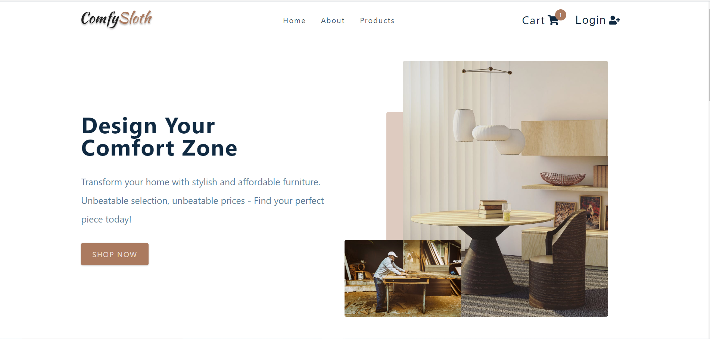
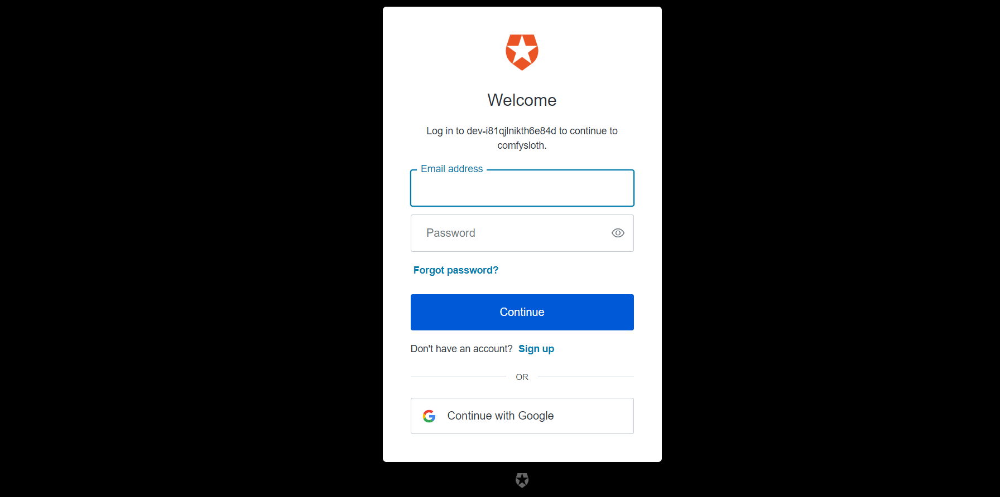
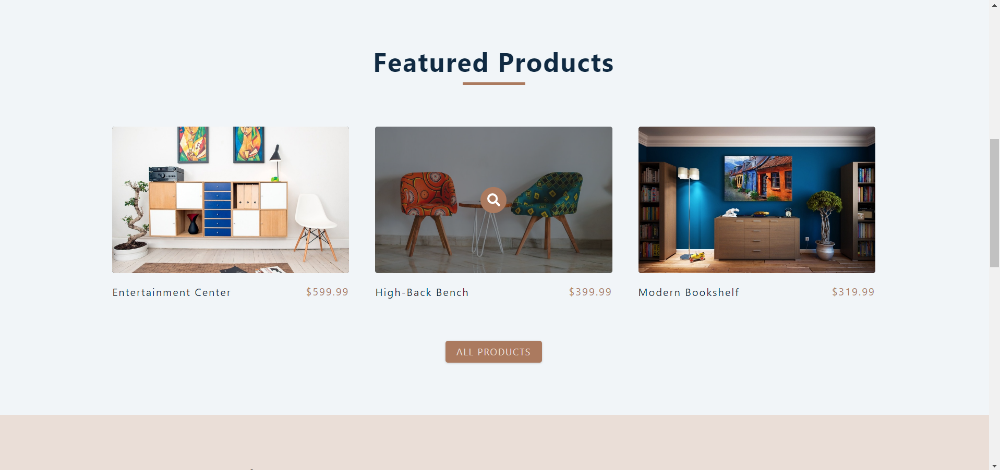
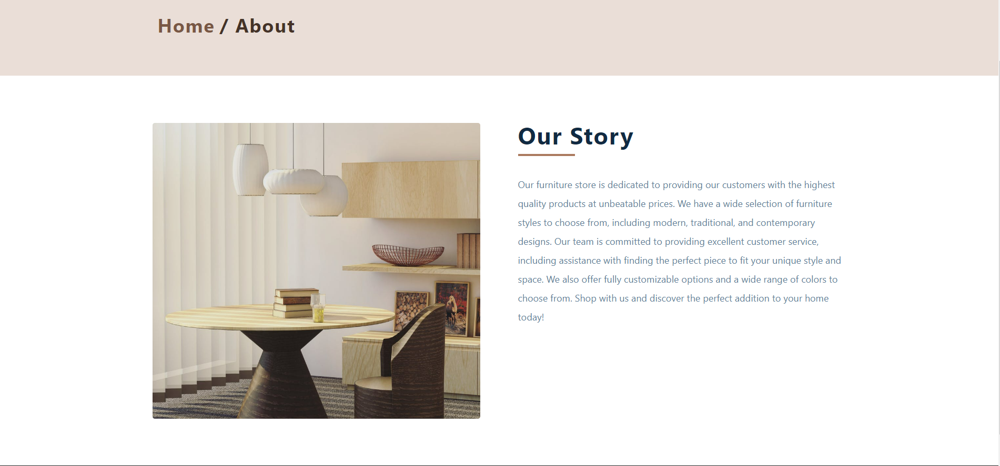
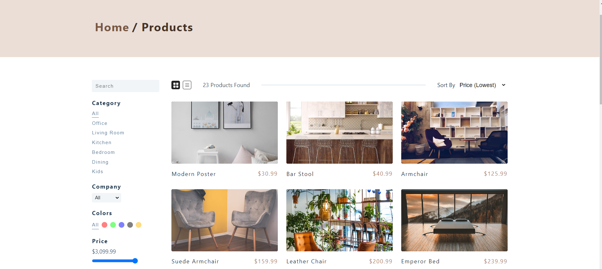
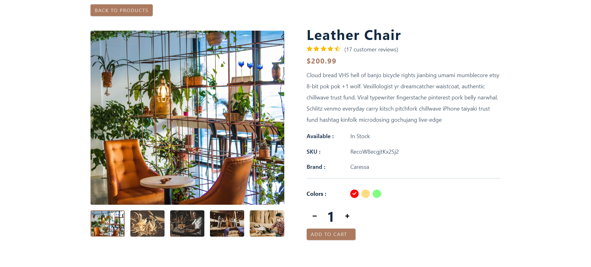
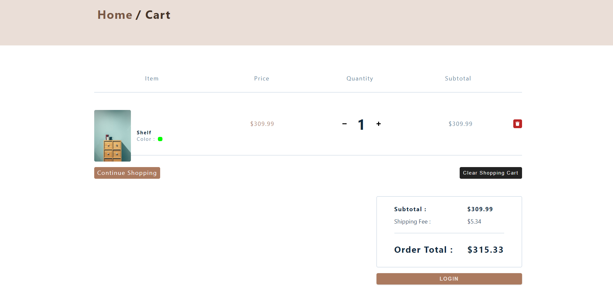
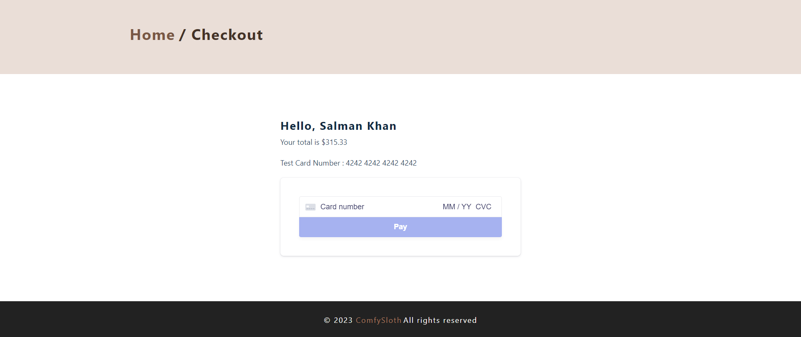

# ComfySloth

A furniture based e-commerce platform developed by me in the span of one week. The project aims to provide an easy and comfortable shopping experience for customers looking for furniture online.

## Tech Stack 
- React Js
- Styled-Components
- AuthO-React
- Stripe

## Demo
<a target = "_blank" href= "https://comfy-sloth-25.netlify.app">comfysloth </a>

## Features of the website

### Landing Page

### Authentication

### Featured Products

### About Page

### Products Page

### Product Description Page

### Cart Page

### Checkout Page

## Made By <a href = "https://github.com/salman-2523">Salman</a>
